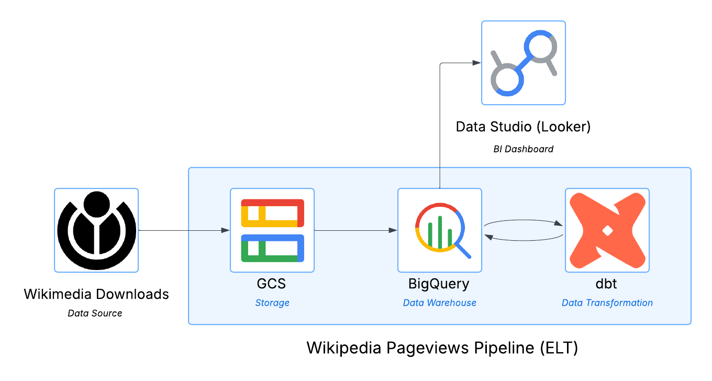
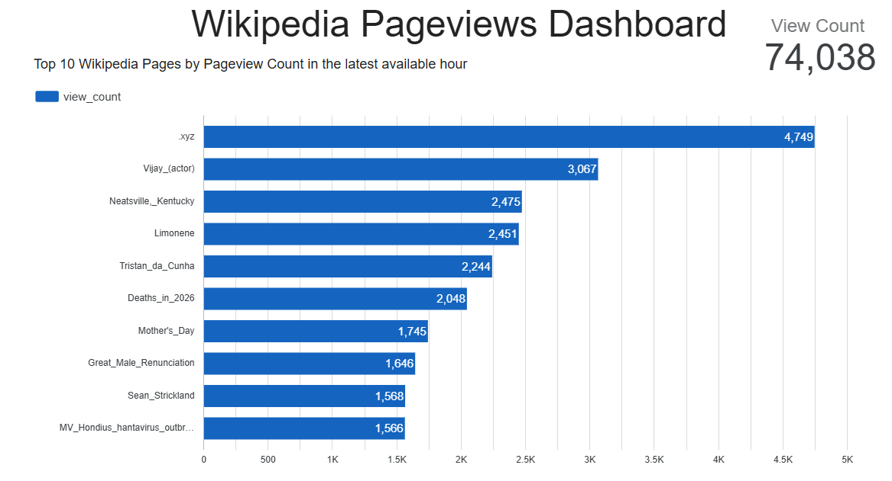

# Wikipedia Pageviews Pipeline

An end-to-end cloud data engineering pipeline that ingests hourly Wikipedia pageview data, transforms it with dbt, orchestrates it with GitHub Actions, and visualizes it in Looker Studio.

## Architecture



GitHub Actions orchestrates the full pipeline on an hourly schedule.

## Stack

| Layer | Tool |
|---|---|
| Ingestion | Python, `google-cloud-storage` |
| Storage | Google Cloud Storage |
| Warehouse | BigQuery |
| Transformation | dbt Core |
| Orchestration | GitHub Actions |
| Visualization | Looker Studio |

## Data Engineering Concepts Demonstrated

- **ELT pipeline** - raw data lands in GCS and BigQuery before any transformation occurs
- **Data lake layer** - GCS stores raw gzipped files partitioned by `year/month/day/`
- **Time partitioning** - BigQuery table is partitioned by hour for efficient querying
- **Staging + marts pattern** - dbt models follow a two-layer architecture separating raw cleaning from business logic
- **Incremental loading** - pipeline appends new hourly data without overwriting existing records
- **Orchestration** - GitHub Actions runs the pipeline on a cron schedule with no external orchestration tool required
- **Dynamic file detection** - pipeline automatically finds the latest available Wikipedia dump without hardcoding dates

## Data Source

Wikipedia publishes pageview counts for every article in every language at hourly intervals via [dumps.wikimedia.org](https://dumps.wikimedia.org/other/pageviews/). Each file contains roughly 6–7 million rows covering all Wikimedia projects worldwide. No API key or signup is required.

## dbt Models

**`stg_pageviews`** — staging model that reads from the raw BigQuery table and filters to:
- English Wikipedia articles only (`language_code = 'en'`)
- Non-zero view counts
- Excludes system pages (`Special:`, `Talk:`, `User:`, `File:`, `Wikipedia:`, `Portal:`)

**`top_articles`** — mart model that selects the top 100 most viewed articles from the latest available hour.

## Pipeline Flow

1. GitHub Actions triggers `pipeline.py` every hour
2. The script detects the latest available Wikipedia dump by checking the dumps server
3. The file is streamed directly from Wikipedia into GCS
4. BigQuery loads the file from GCS into the raw `pageviews` table
5. The `viewed_at` timestamp is set on the newly loaded rows
6. dbt runs and refreshes the staging and mart models
7. Looker Studio reflects the updated data automatically

## Setup

### Prerequisites
- Google Cloud project with billing enabled
- GCS bucket and two BigQuery datasets: `wikipedia_raw` and `wikipedia_marts`
- Python 3.12+

### Local setup

```bash
git clone https://github.com/wb73-eu/wikipedia-pageviews-pipeline.git
cd wikipedia-pageviews-pipeline
python3 -m venv venv
source venv/bin/activate
pip install -r requirements.txt
gcloud auth application-default login
python3 pipeline.py
cd wikipedia_transforms && dbt run
```

## Dashboard

Built in Looker Studio connected directly to the `wikipedia_marts.top_articles` BigQuery table. Shows the top 10 most viewed English Wikipedia articles for the latest hour with total view counts.



## Future Improvements

- Expand dbt models to include trend analysis and additional languages
- Build out the Looker Studio dashboard with additional charts and time series visualizations